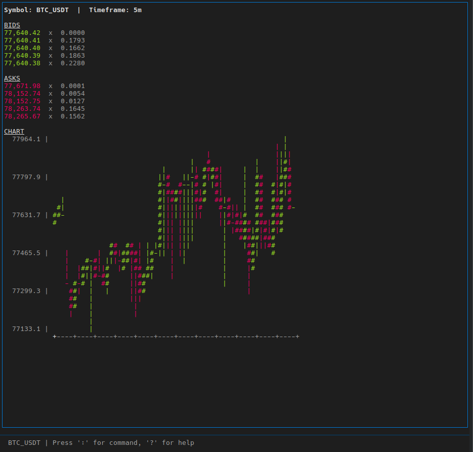

# nonkyc-cli

Lightweight CLI + TUI trading terminal for NonKYC exchange.

## Features

* Real-time order book viewer
* ASCII candlestick chart rendering
* CLI tools for price / balance / orderbook
* Interactive TUI interface (Textual)
* Switchable trading symbol
* Switchable timeframe (candles)

---

## Install

```bash
pip install -r requirements.txt
```

---

## Run TUI

```bash
python trader.py
```

---

## CLI Usage

### Price

```bash
python -m nonkyc.cli price BTC/USDT
```

### Order book

```bash
python -m nonkyc.cli orderbook BTC/USDT --limit 20
```

### Balance

```bash
python -m nonkyc.cli balance
```

---

## TUI Controls

Inside interface:

* Enter `BTC/USDT` → change symbol
* Enter `5`, `15`, `60` → change timeframe (minutes)

---

## API

Uses public NonKYC API:

* `/market/orderbook`
* `/market/candles`

Base URL:

```
https://api.nonkyc.io/api/v2
```
